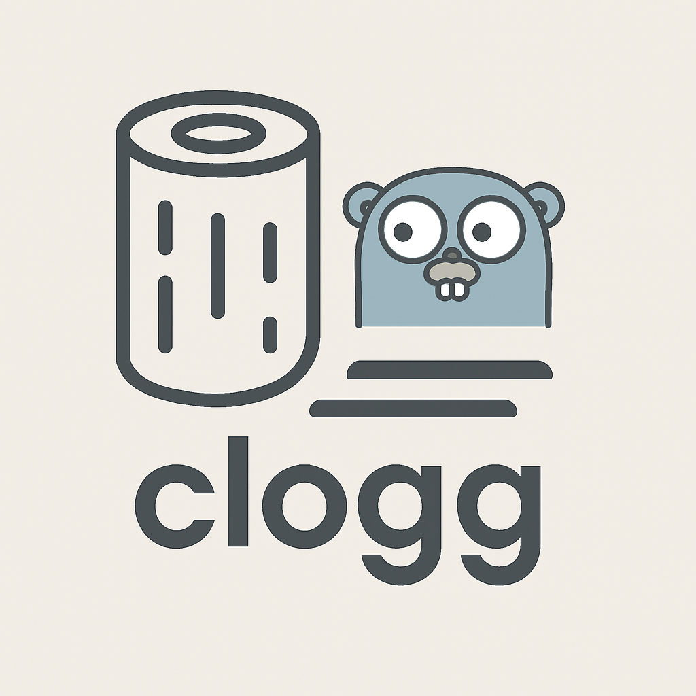

<!-- # clogg -->
clogg is a simple, fast, and asynchronous logging package for Go, built entirely with the standard library. It wraps the log/slog package to provide non-blocking, structured logging by processing logs in a separate goroutine. Designed for performance and ease of use, clogg offers a clean API and integrates seamlessly into your Go applications.
